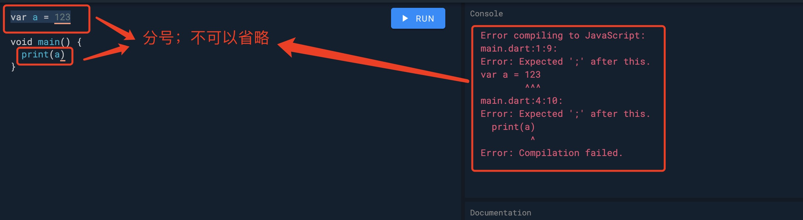

1. dart 以.dart 为后缀名

2. 每一个dart 应用程序都必须有一个根main 方法为入口文件

        void main(){
            new Root()
        }

3. 注释

+ 单行注释 //

+ 多行注释 /*  */

+ 文档注释 /// 

4. Dart 没有关键字 “public” ， “protected” 和 “private” 。 如果标识符以下划线（_）开头，则它相对于库是私有的

5. 语句后面的分号不可以省略，不然会报错

每条指令的行称为一条语句。每个dart语句必须以分号（;）结尾。一行可以包含多个语句。但是，这些语句必须用分号分隔。

        var a = 123

6. dart cli

 + analyze   Analyze the project's Dart code.
 + compile   Compile Dart to various formats.
 + create    Create a new project.
 + format    Idiomatically format Dart source code.
 + pub       Work with packages.
 + run       执行dart 项目

        dart run learn.dart
        
 + test      Run tests in this package.