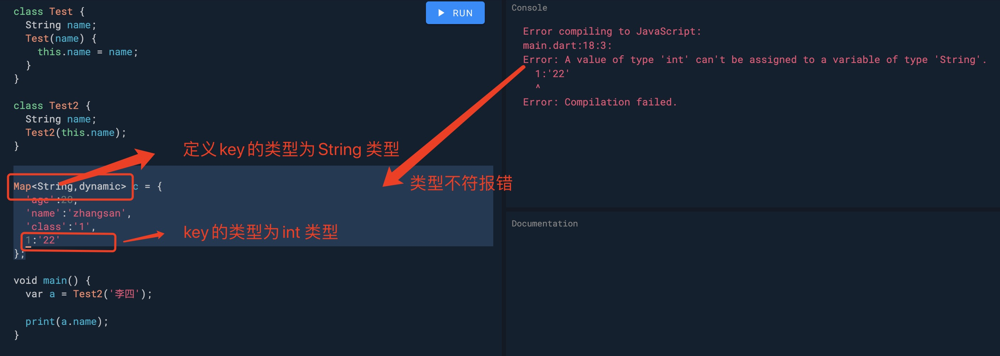
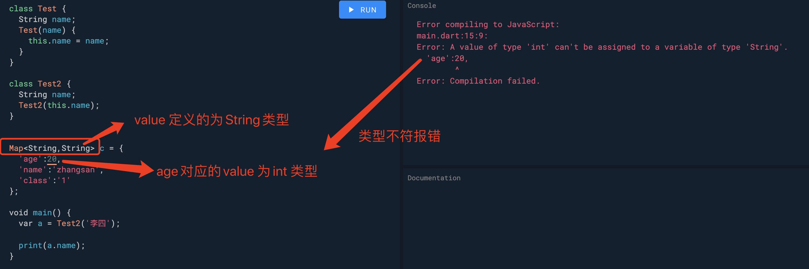

1. number: 数字

+ int 整型

        int a = 3;

+ double: 双精度类型

        double a = 2.3;

2. String : 字符串

使用单引号('') 或者双引号("") 括起来

> 字符串表达式 ：$variableName (或 ${expression}) 类似es6 模板替换

    void main(){
        var a = 1;
        print('$a is int');
        print('${a} is int');
    }

    // 1 is int;

3. Boolean  布尔类型

只有true/false 类型

        bool b = false;

4. List 数组

        var b = [1,2,3,4,5]

5. Map 对象/字典({})

        var c = {
            'age':22
        }

        Map<any,any> c ={}

        第一个为key 的类型
        第二个为value的类型

  **注意**

  Map 中key 值必须使用引号括起来，不然会被当做变量去取值，而如果没有设置和key 相同名称的变量，会报错。

> 类型报错

+ Map key 类型报错

        Map<String,dynamic> c = {
            'age':20,
            'name':'zhangsan',
            'class':'1',
            1:'22'
        };

        // 设置key 的类型为String
        但是1 为int 类型

+ Map value 类型报错

6. 特殊的set

在 Dart 中 Set 是一个元素唯一且无需的集合

        var halogens = {'fluorine', 'chlorine', 'bromine', 'iodine', 'astatine'};

要创建一个空集，使用前面带有类型参数的 {} ，或者将 {} 赋值给 Set 类型的变量：

        var names = <String>{};

> 是 Set 还是 Map ？ Map 字面量语法同 Set 字面量语法非常相似。 因为先有的 Map 字母量语法，所以 {} 默认是 Map 类型。   如果忘记在 {} 上注释类型或赋值到一个未声明类型的变量上，   那么 Dart 会创建一个类型为 Map<dynamic, dynamic> 的对象。