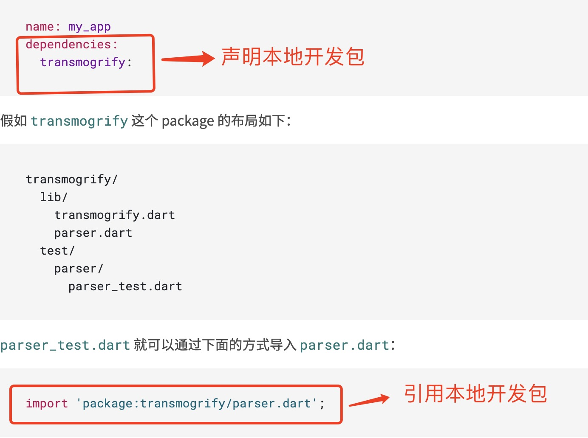

1. 在dart 中，每一个dart 文件就是一个库。

2. dart 库分为三种

> 自定义的库（即开始时写的dart文件)

使用路径导入

        import 'lib/util.dart'

        import '../lib/util.dart'

> dart 核心库

        import 'dart:io'

        import 'dart:core' // 会自动导入到每一个dart应用中

> 第三方库

包可以是pub 上的亦可以是github 上的

pub: 地址：https://pub.flutter-io.cn/

Dart 运行时会抓取 package: 之后的内容，并在应用程序的 .packages 文件中查找它。

        import 'package:js/js.dart'
        import 'package:http/http.dart'

**注意**

也可以使用此方式从自己的包中导入库，但是需要在pubspec.yaml 文件中dependencies 中定义

3. pub get 获取依赖包

    第一次获取依赖时，Pub 会下载依赖及其兼容的最新版本。然后通过创建 lockfile 锁定依赖，以始终使用这个版本。 Pub 会在 pubspec 旁创建并存储一个名为 pubspec.lock 文件。它列出了使用的每个依赖包的指定版本（当前包或传递包的版本）

    当pub获取远程软件包时，它将其下载到pub维护的单个系统缓存目录中。在Mac和Linux上，该目录默认为~/.pub-cache。在Windows上，该文件位于中%LOCALAPPDATA%\Pub\Cache\bin，尽管其确切位置可能因Windows版本而异。您可以使用PUB_CACHE环境变量指定其他位置 。

    程序包进入系统缓存后，pub将创建一个.packages文件，该文件将应用程序使用的每个程序包映射到缓存中的相应程序包。

    您只需下载一个给定版本的软件包即可，然后可以根据需要在多个软件包中重复使用它。您可以删除和重新生成.packages文件，而无需访问网络。