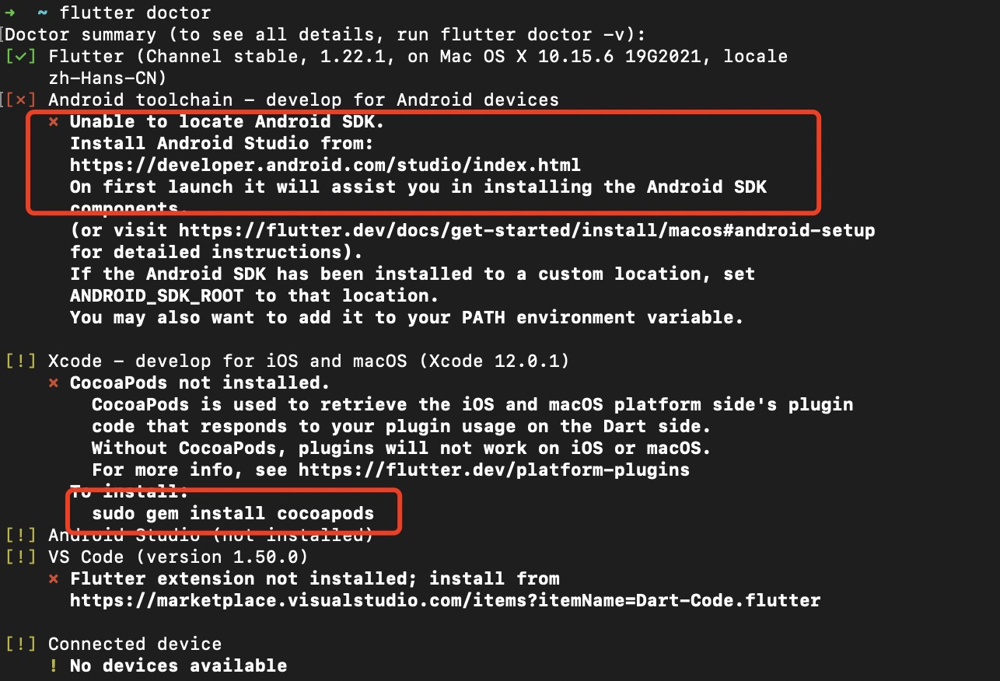
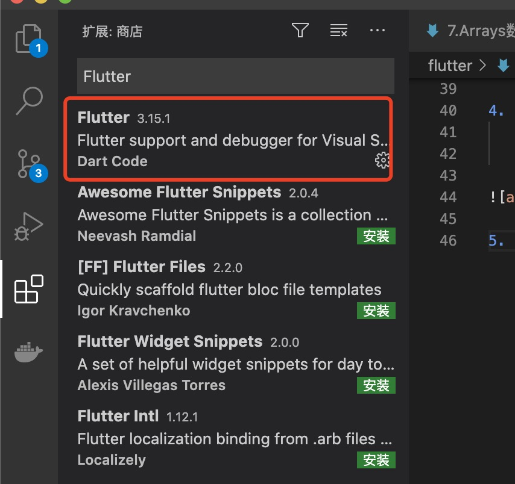
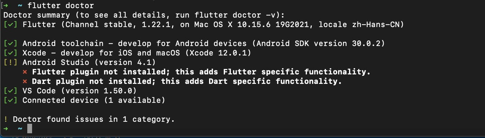
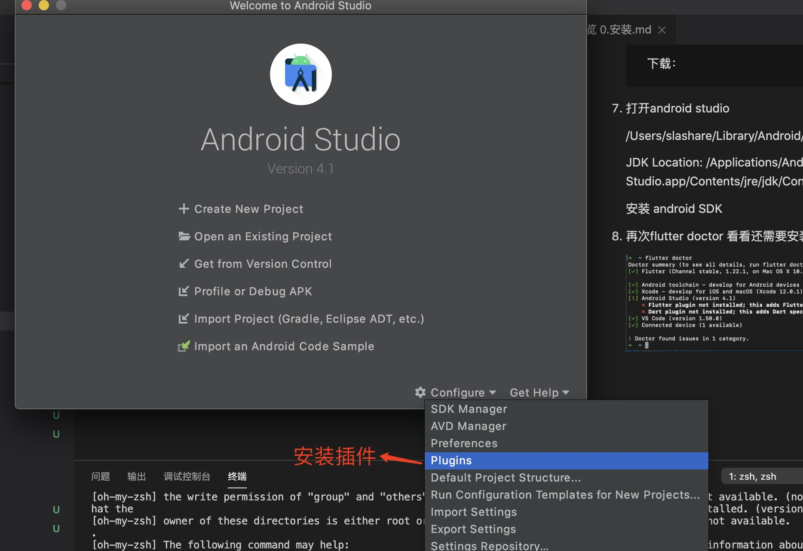
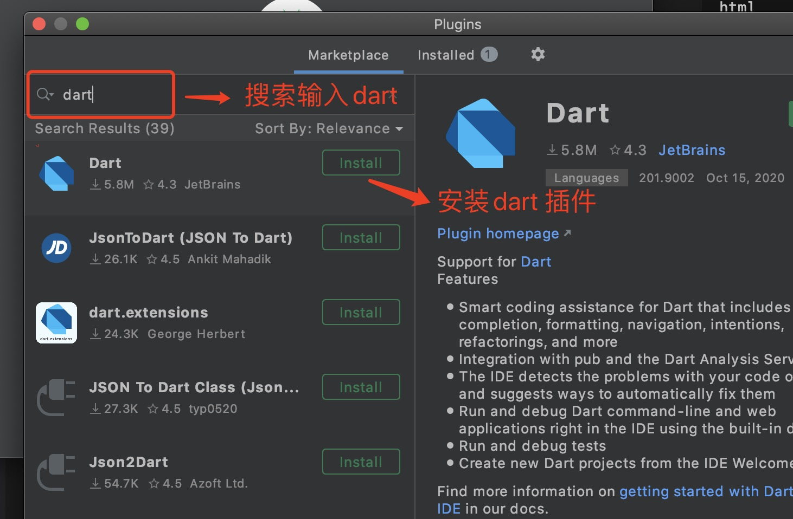
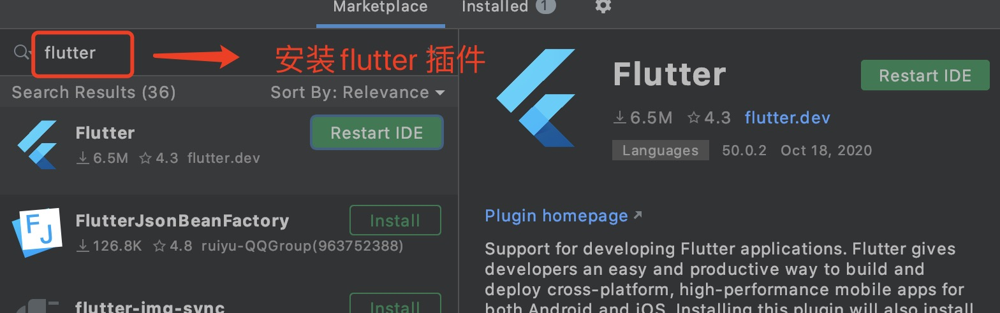

1. 下载flutter SDK

        https://flutter.cn/docs/get-started/install/macos

2. 解压到（根用户）flutterSDK 目录中，设置环境变量 $PATH

+ 进入用户根目录

        cd ~

+ 创建.bash_profile

        touch .bash_profile
+ 编辑.bash_profile

        open -e .bash_profile
+ 在.bash_profile文件中输入

        export PATH=~/flutterSDK/flutter/bin:$PATH
        export PUB_HOSTED_URL=https://pub.flutter-io.cn //国内用户需要设置
        export FLUTTER_STORAGE_BASE_URL=https://storage.flutter-io.cn //国内用户需要设置

+ command+s保存

+ 更新环境变量文件

        source .bash_profile
+ 验证

        echo $PATH

如果此时有出现类似/xxx/xxx/flutter/bin ，证明环境变量更新成功，可以在任意窗口使用flutter命令，但此时要注意一点: 如果你使用的是zsh，关闭终端，重新启动终端时 ~/.bash_profile 将不会被加载，解决办法就是修改 ~/.zshrc 这样关闭终端再次启动时，~/.bash_profile 就会被再次加载

        修改方法：echo 'source ~/.bash_profile' >> ~/.zshrc。

3. 验证

        flutter --version

4. doctor 检验flutter 环境需要的东西

        flutter doctor

5. vsCode 中 安装Flutter 插件

6. 安装 android studio

        https://developer.android.com/studio/index.html

        下载：

7. 打开android studio 

    /Users/slashare/Library/Android/sdk

    JDK Location: /Applications/Android Studio.app/Contents/jre/jdk/Contents/Home

    安装 android SDK

8. 再次flutter doctor 看看还需要安装什么

   

9. android studio 安装flutter 和 dart 插件

   
   
   

10. licenses 

        flutter doctor --android-licenses

11. 运行flutter 错误

> Could not resolve com.android.tools.build:gradle:3.5.0.

    + android licenses 

    + 修改 android/ build.gradle

            buildscript {
                ext.kotlin_version = '1.3.50'
                repositories {
                    maven {
                        url 'https://maven.aliyun.com/repository/google'
                    }
                    maven {
                        url 'https://maven.aliyun.com/repository/jcenter'
                    }
                    maven {
                        url 'http://maven.aliyun.com/nexus/content/groups/public'
                    }
                    //google()
                    //jcenter()
                }

                dependencies {
                    classpath 'com.android.tools.build:gradle:3.5.0'
                    classpath "org.jetbrains.kotlin:kotlin-gradle-plugin:$kotlin_version"
                }
            }

            allprojects {
                repositories {
                    maven {
                        url 'https://maven.aliyun.com/repository/google'
                    }
                    maven {
                        url 'https://maven.aliyun.com/repository/jcenter'
                    }
                    maven {
                        url 'http://maven.aliyun.com/nexus/content/groups/public'
                    }
                    //google()
                    //jcenter()
                }
            }
        + 修改fluttersdk 中 packages/flutter_tools/gradle/flutter.gradle

            buildscript {
                repositories {
                    //google()
                    //jcenter()
                   maven { url 'https://maven.aliyun.com/repository/google' }
                    maven { url 'https://maven.aliyun.com/repository/jcenter' }
                    maven { url 'http://maven.aliyun.com/nexus/content/groups/public'}
                }
                dependencies {
                    classpath 'com.android.tools.build:gradle:3.5.0'
                }
            }
