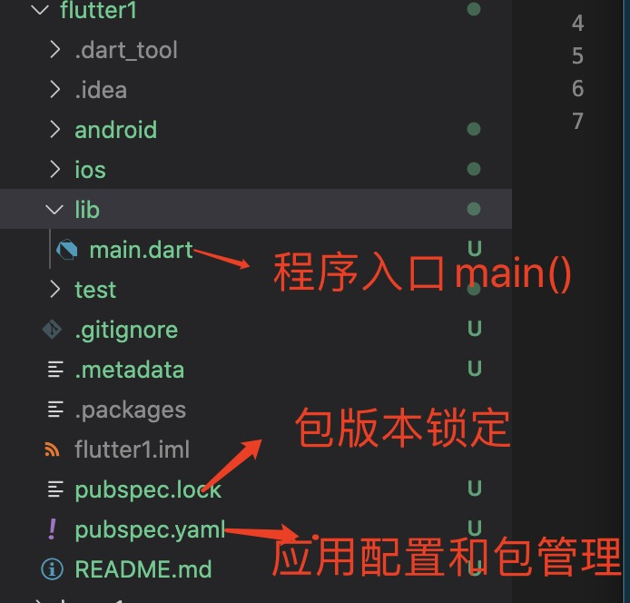

1. 使用 flutter 命令创建一个叫myApp 的应用

        flutter create myApp

2. 打开应用：

3. 应用程序所需的代码在 ‘lib/main.dart’

4. 修改main.dart

        import 'package:flutter/material.dart';

        // dart 语言要求有一个main 函数当做入口文件
        void main() {
            runApp(MyApp());
        }

        // 或者
        void main()=>runApp(MyApp());
        主函数（main）使用了 (=>) 符号，这是 Dart 中单行函数或方法的简写。

        class MyApp extends StatelessWidget {
            @override
            Widget build(BuildContext context) {
                return MaterialApp(
                title: 'Welcome to Flutter',
                home: Scaffold(
                    appBar: AppBar(
                    title: Text('Welcome to Flutter'),
                    ),
                    body: Center(
                    child: Text('Hello World'),
                    ),
                ),
                );
            }
        }

