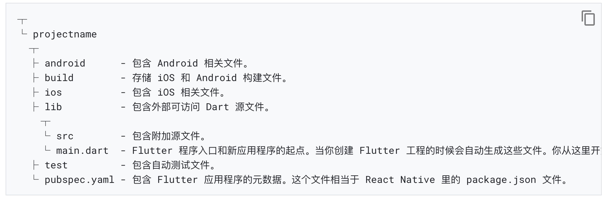
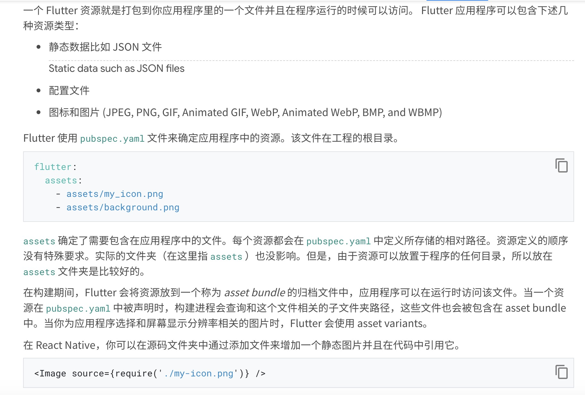

1. 在flutter 中都是基于组件的，而每一个组件都是一个类，参数通过组件的构造方法传递参数

    在 Flutter 中，几乎所有都是 widget，包括对齐 (alignment)、填充 (padding) 和布局 (layout)。

2. wedget 分为状态组件和非状态组件（参照react)

+ StatelessWidget: 无状态组件

无状态 widget 接收的参数来自于它的父 widget，它们储存在 final 成员变量中

+ StatefulWidget: 有状态组件

    有状态 widget (StatefulWidget) 会基于接收到的数据或者用户输入的数据动态改变状态

    Stateful widgets 持有的状态可能在 widget 生命周期中发生变化，实现一个 stateful widget 至少需要两个类： 
    
    + 1）一个 StatefulWidget 类；
    + 2）一个 State 类，StatefulWidget 类本身是不变的，但是 State 类在 widget 生命周期中始终存在
        

3. 一个 widget 的主要工作是提供一个 build() 方法来描述如何根据其他较低级别的 widgets 来显示自己(类似于react 中的render 函数)

            @override
            Widget build(BuildContext context) {
                return MaterialApp(
                    title: 'Welcome to Flutter',
                    home: Scaffold(
                        appBar: AppBar(
                             title: Text('Welcome to Flutter'),
                        ),
                        body: Center(
                            child: Text('Hello World'),
                        ),
                    ),
                );
            }

            AppBar(title: Text('Welcome to Flutter'))

            调用AppBar 的构造函数，接受一个参数title,title 的类型是widget 

            Text('Welcome to Flutter') 文本组件

4. 在dart 里，***每个应用程序必须有一个最顶级的main()函数，该函数作为应用程序的入口函数***

        // Dart
        main() {
        }

5. 在 Dart 中，未初始化的变量会有一个初始值 null。因为数字在 Dart 是对象，甚至未初始化的数字类型的变量也会是 null。

6. 在dart 中， Future 和JavaScript中的Promise 对象类似，一样是异步的，支持then

        import 'dart:convert';
        import 'package:http/http.dart' as http;

        class Example {
            Future<String> _getIPAddress() {
                final url = 'https://httpbin.org/ip';
                return http.get(url).then((response) {
                    String ip = jsonDecode(response.body)['origin'];
                    return ip;
                });
        }
        }

7. ui包

        在 Flutter 中，如果要使用 Material Design 库里的 widget，导入 material.dart 包

        import 'package:flutter/material.dart';

8. 目录结构

9. 静态资源文件

在 Flutter 中，如果要增加静态图片的话就在 widget 的 build 方法中使用 AssetImage 类。

        image: AssetImage('assets/background.png'),

10. 网络图片

        // Flutter
        body: Image.network(
          'https://flutter.io/images/owl.jpg')