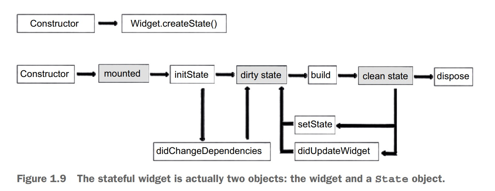

1. 状态组件分两个类，一个类为组件类，一个组件为状态类

2. 生命周期

3. 组件

        class Hello extends StatefulWidget{
            // 构造函数
            Hello();

            @override
            _HelloState createState() =>_HelloState();
        }

4. 状态类

        class _HelloState extends State<Hello>{
            //1. _HelloState 构造函数
            _HelloState();

            //2. 当组件类执行createState，组件挂载（mounted) 完成
            @override
            void initState() {
                // TODO: implement initState
                super.initState();
            } 

            //3. build 
            Widget build(BuildContext context){
                return Container(child:Text('hello'))
            }

            // 卸载释放，
             @override
             void dispose() {
                // TODO: implement dispose
                super.dispose();
             }
        }

5. 状态更改setState((){})

        void onChangeName(){
            setState((){
                this.name='hello flutter';
            })
        }