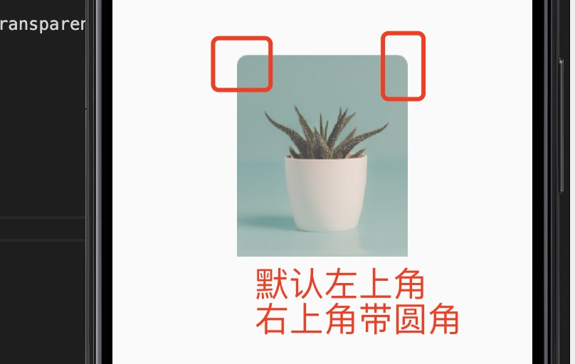

1. Image 图片组件

+ Image.asset(path) : 本地图片

+ Image.network(url): 网络图片

+ Image.file(): 从文件读取图片

+ Image.memory()

2. AssetImage : 是Image.asset 的简写

   自动执行可感知像素密度的资产解析，

   要指定针对不同像素比率的资产，请将变体资产放在应用程序捆绑包中的子目录下，形式为“ Nx”，其中N是该资产的标称设备像素比率

   例如，假设应用程序要使用一个名为“ heart.png”的图标。此图标的表示形式为1.0（主图标），以及1.5和2.0像素比率（变量）。然后，资产捆绑包应包含以下资产

        heart.png
        1.5x/heart.png
        2.0x/heart.png

    在设备像素比为1.0的设备上，选择的图像将是heart.png；在设备像素比为1.3的设备上，选择的图像将为1.5x / heart.png。

    资产的目录级别无关紧要，只要变体处于等效级别即可；也就是说，以下也是有效的捆绑结构：

        icons/heart.png
        icons/1.5x/heart.png
        icons/2.0x/heart.png
        asset / icons / 3.0x / heart.png将是assets / icons / heart.png的有效变体。

3. NetworkImage: 是Image.network 的简写

4. FileImage: 是Image.file 的简写

5. MemoryImage: 是Image.memory 的简写

6. 占位符Image

        FadeInImage.assetNetwork(
            placeholder: 'assets/loading.gif',
            image: 'https://picsum.photos/250?image=9',
        );

7. 缓存图片CachedNetworkImage

   在某些情况下，缓存从网络下载的图像非常方便，因此可以离线使用它们。为此，请使用cached_network_image包装

        import 'package:flutter/material.dart';
        import 'package:cached_network_image/cached_network_image.dart';

        CachedNetworkImage(
        placeholder: (context, url) => CircularProgressIndicator(),
        imageUrl: 'https://picsum.photos/250?image=9',
        );

8. 图片懒加载