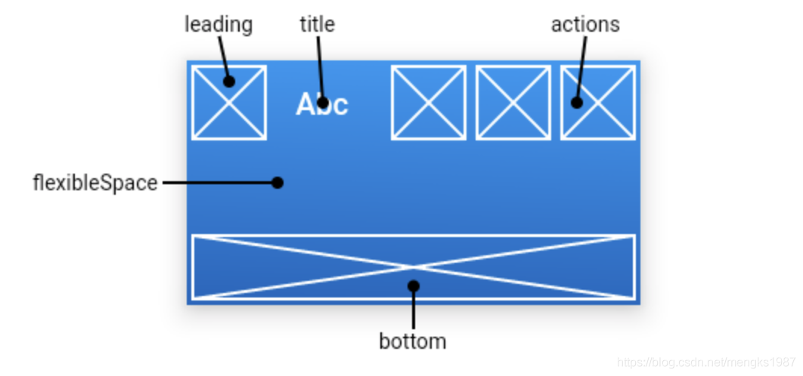
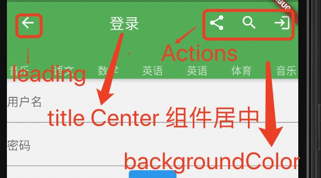

1. AppBar 是Material 风格的组件,结构如下图：

2. 参数说明

> leading: 图标

+ 当有上一级时，默认为Icons.arrow_back，即回退按钮

+ 当有Drawer 时，默认为栏目的图标

+ 自定义图标

        AppBar(
            leading: GestureDetector(
              child: Icon(Icons.arrow_back),
              onTap: () {
                Navigator.pop(context);
              },
            ),
            title: Text('登录')
        ）
> title: 文本

        title不一定是居中的，在Android平台默认是靠左的，设置居中代码如下：

        AppBar(
            title: Text('老孟'),
            centerTitle: true,
        )

> Actions: 右边组件，比如分享等

> backgroundColor: 背景颜色

        AppBar(
            leading: GestureDetector(
              child: Icon(Icons.arrow_back),
              onTap: () {
                Navigator.pop(context);
              },
            ),
            title: Center(child: Text('登录')),
            actions: [
              Padding(
                padding: EdgeInsets.all(10),
                child: Icon(Icons.share),
              ),
              Padding(
                padding: EdgeInsets.all(10),
                child: Icon(Icons.search),
              ),
              Padding(
                padding: EdgeInsets.all(10),
                child: Icon(Icons.login),
              ),
            ],
            backgroundColor: Colors.green,
            bottom: TabBar(
                isScrollable: true,
                tabs: <Widget>[
                  Text('语文'),
                  Text('数学'),
                  Text('英语'),
                  Text('英语'),
                  Text('体育'),
                  Text('音乐'),
                  Text('语文'),
                  Text('数学'),
                  Text('英语'),
                  Text('英语'),
                  Text('体育'),
                  Text('音乐'),
                ],
                controller: TabController(initialIndex: 1, length: 12, vsync: this)),

> 