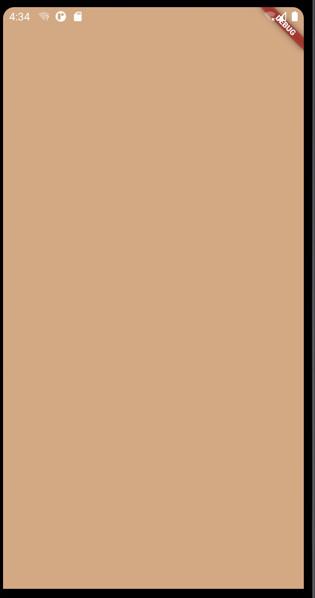

1.  Scaffold : 是一个路由页的骨架，我们使用它可以很容易地拼装出一个完整的页面。

   每个页面的开头使用Scaffold ,但是当前页的其他组件就不需要再使用了。
   经常会作为MaterialApp的子Widget, Scaffold会自动填充可用的空间，这通常意味着它将占据整个窗口或屏幕，
   并且Scaffold会自动适配屏幕。我们的布局就是在Scaffold中进行编写的

2. Scaffold

+ appBar: 顶部状态栏

+ body: 主体

+ floatingActionButton: 悬浮按钮

+ drawer： 左边抽屉

+ endDrawer： 右边抽屉

+ bottomNavigationBar： 底部导航

+ backgroundColor： 整屏幕的背景颜色

+ resizeToAvoidBottomInset: 

 在 scafold 里设置 resizeToAvoidBottomInset: false，键盘会遮住布局，而不是顶起布局

3. SnackBar 显示在顶部的提示框

            fElevatedButton(
               onPressed: () {
                  final snackBar = SnackBar(
                     content: Text('Yay! A SnackBar!'),
                     action: SnackBarAction(
                     label: 'Undo',
                     onPressed: () {
                        // Some code to undo the change.
                     },
                     ),
                  );

                  // Find the Scaffold in the widget tree and use
                  // it to show a SnackBar.
                  Scaffold.of(context).showSnackBar(snackBar);
         },

