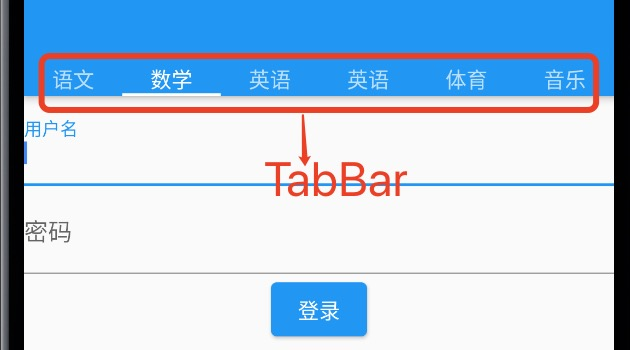
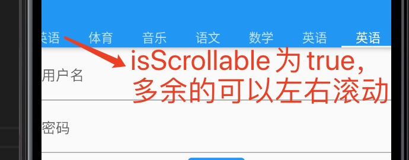
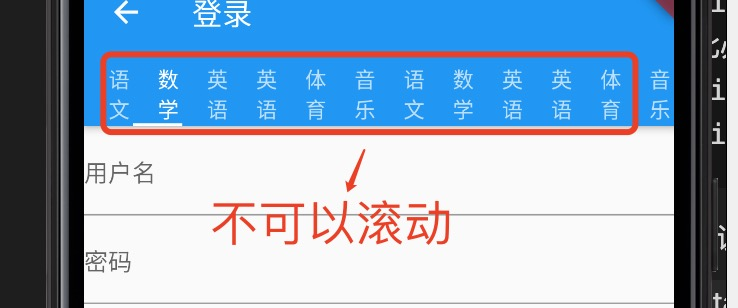
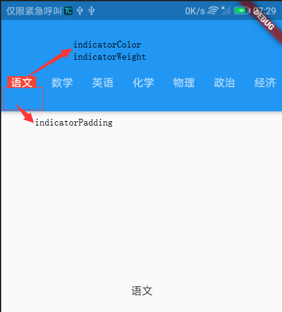

1. TabBar 标签实现tab 标签的切换

2. 要使用TabBar 必须混入TickerProviderStateMixin，

        class _LoginState extends State<Login> with TickerProviderStateMixin {
                @override
                Widget build(BuildContext context) {
                    return Scaffold(
                        appBar: AppBar(
                            leading: GestureDetector(
                            child: Icon(Icons.arrow_back),
                            onTap: () {
                                Navigator.pop(context);
                            },
                            ),
                            title: Text('登录'),
                            bottom: TabBar(tabs: <Widget>[// TabBar
                            Text('语文'),
                            Text('数学'),
                            Text('英语'),
                            Text('英语'),
                            Text('体育'),
                            Text('音乐'),
                            ], controller: TabController(initialIndex: 1, length: 6, vsync: this))),// TabController 是必须的
                        body: Center(child: LoginForm()));
                }
        }

3. 使用TabBar 必须知道相应的TabController

            TabController(initialIndex: 1, length: 6, vsync: this)

            + initialIndex: 初始选中的下标

            + length: tabs 长度，必须和设置的tabs 长度一致，不然保存

            + vsync: TickerProvider， 因此必须混入TickerProviderStateMixin

4. 参数说明

> tabs:<Widget>[] tab 标签集合

> controller: TableController

> onTap: 点击事件

> isScrollable: 是否可以滚动

+ true

+ flase

> indicatorColor,indicatorWeight,indicatorPadding

5. DefaultTabController 默认controller

        Widget build(BuildContext context) {
            return new DefaultTabController(length: myTabs.length,
                child:
                new Scaffold(
                appBar: new AppBar(
                    bottom: new TabBar(
                    tabs: myTabs,
                    isScrollable: true,
                    indicatorSize: TabBarIndicatorSize.tab,
                    labelColor: Colors.white,
                    labelStyle: new TextStyle(fontSize: 16.0),
                    unselectedLabelColor: Colors.black,
                    unselectedLabelStyle: new TextStyle(fontSize: 12.0),
                    ),
                ),
                body: new TabBarView(
                    children: myTabs.map((Tab tab) {
                    return new Center(child: new Text(tab.text));
                    }).toList(),
                ),
                ),
            );
        }

6. 使用ListView 模拟TabBar

            @override
        Widget build(BuildContext context) {
            return Padding(
            padding: const EdgeInsets.symmetric(vertical: kDefaultPaddin),
            child: SizedBox(
                height: 25,
                child: ListView.builder(
                   scrollDirection: Axis.horizontal, // 横向滚动
                   itemCount: categories.length,
                   itemBuilder: (context, index) => buildCategory(index),
                ),
            ),
            );
        }

        Widget buildCategory(int index) {
            return GestureDetector(
            onTap: () {
                setState(() {
                selectedIndex = index;
                });
            },
            child: Padding(
                padding: const EdgeInsets.symmetric(horizontal: kDefaultPaddin),
                child: Column(
                crossAxisAlignment: CrossAxisAlignment.start, // 默认居中显示
                children: <Widget>[
                    Text(
                    categories[index],
                    style: TextStyle(
                        fontWeight: FontWeight.bold,
                        color: selectedIndex == index ? kTextColor : kTextLightColor,
                    ),
                    ),
                    Container(
                        margin: EdgeInsets.only(top: kDefaultPaddin / 4), //top padding 5
                        height: 2,
                        width: 30,
                        color: selectedIndex == index ? Colors.black : Colors.transparent, // tab 选中选项
                    )
                ],
                ),
            ),
            );
        }
        }