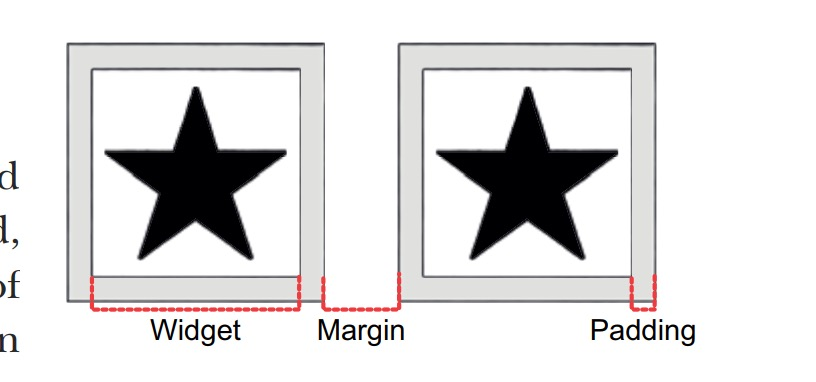

1. Container: 向 widget 增加 padding、margins、borders、background color 或者其他的“装饰”

   

+ 增加 padding、margins、borders

+ 改变背景色或者图片

+ 只包含一个子 widget，但是这个子 widget 可以是行、列或者是 widget 树的根 widget

2. child: Container 只有一个子组件   

3. 组件的属性

+ width: 宽度

+ height: 高度

+ margin: 两个Container 之间的间距

+ padding: Container 内部空白

+ color: 背景色,简单的纯色

+ decoration： 装饰, 比如背景图片，形状等

+ shape: BoxShape.circle, // 将其形状设置为圆形，但此形状不能设置圆角属性