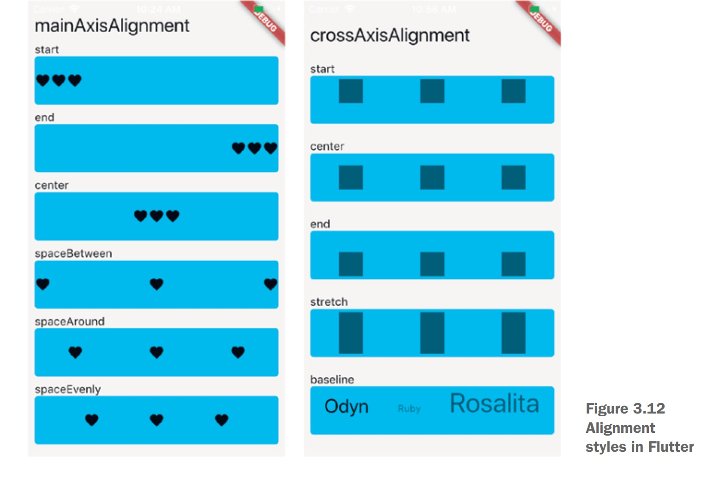
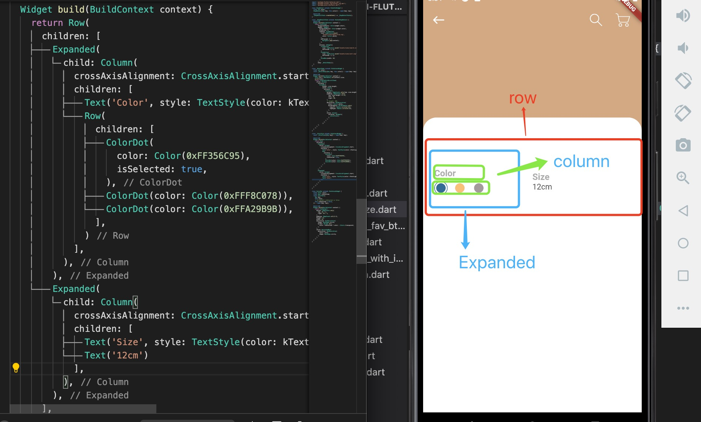

1. Row: 所有元素在一行显示，

+ key: 该属性代表当前widget的唯一标识符(类似于Android中的id)，在程序运行过程中，如果想调用该widget的某个方法，那就需要设置该属性值，该属性不是必须值

+ mainAxisAlignment: 子元素在主轴的对齐方式，Row的主轴即为水平方向

+ mainAxisSize: 主轴方向大小适配方式，只有两种取值方式：

   + MainAxisSize.max 主轴方向大小(在Row中指宽度)与父容器大小相同(即Android中的match_parent)
   + MainAxisSize.min 主轴方向大小(在Row中指宽度)由子元素决定(即Android中的wrap_content)

+ crossAxisAlignment: 子元素在交叉轴(垂直方向)的对齐方式

+ children: 子元素列表

2. Column: 一个元素占据一行

> 当Column 子元素包括约束组件时，使用Expanded 包裹，比如图片等

+ key: 该属性代表当前widget的唯一标识符(类似于Android中的id)，在程序运行过程中，如果想调用该widget的某个方法，那就需要设置该属性值，该属性不是必须值

+ mainAxisAlignment: 子元素在主轴的对齐方式，Column的主轴即为垂直方向

+ mainAxisSize: 主轴方向大小适配方式，只有两种取值方式：

    + MainAxisSize.max 主轴方向大小(在Column中指高度)与父容器大小相同(即Android中的match_parent)

    + MainAxisSize.min 主轴方向大小(在Column中指高度)由子元素决定(即Android中的wrap_content)

+ crossAxisAlignment: 子元素在交叉轴(水平方向)的对齐方式

> 使用column 布局时，默认子元素时居中显示，使用CrossAxisAlignment.start 从左边开始。

+ children: 子元素列表

3. 对齐方式

4. 常见布局

