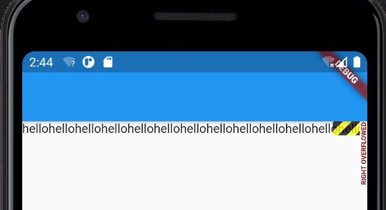

1. 在介绍Row和Colum时，如果子widget超出屏幕范围，则会报溢出错误，如：

        Row(
            children: <Widget>[
                Text("xxx"*100)
            ],
        );

2. 使用Wrap

        Wrap(
            spacing: 8.0, // 主轴(水平)方向间距
            runSpacing: 4.0, // 纵轴（垂直）方向间距
            alignment: WrapAlignment.center, //沿主轴方向居中
            children: <Widget>[
                new Chip(
                avatar: new CircleAvatar(backgroundColor: Colors.blue, child: Text('A')),
                label: new Text('Hamilton'),
                ),
                new Chip(
                avatar: new CircleAvatar(backgroundColor: Colors.blue, child: Text('M')),
                label: new Text('Lafayette'),
                ),
                new Chip(
                avatar: new CircleAvatar(backgroundColor: Colors.blue, child: Text('H')),
                label: new Text('Mulligan'),
                ),
                new Chip(
                avatar: new CircleAvatar(backgroundColor: Colors.blue, child: Text('J')),
                label: new Text('Laurens'),
                ),
            ],
        )