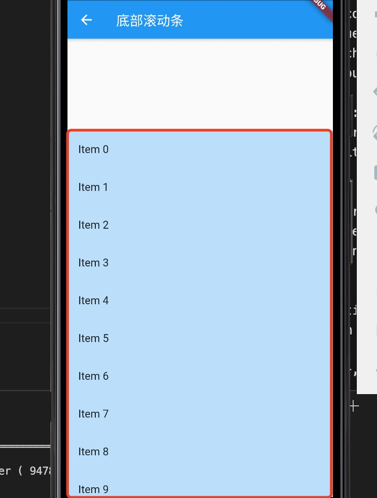

1. DraggableScrollableSheet 底部滚动栏，可以滚动到头部。

        DraggableScrollableSheet({
            Key key,
            this.initialChildSize = 0.5,
            this.minChildSize = 0.25,
            this.maxChildSize = 1.0,
            this.expand = true,
            @required this.builder,
        }) 

        DraggableScrollableSheet(
            initialChildSize: 0.8,
            builder: (BuildContext context, ScrollController scrollController) {
            return Container(
                color: Colors.blue[100],
                child: ListView.builder(
                controller: scrollController,
                itemCount: 25,
                itemBuilder: (BuildContext context, int index) {
                    return ListTile(title: Text('Item $index'));
                },
                ),
            );
            },
      ),

2. 参数

+ bulider： 

+ initialChildSize: 初始化大小，默认为整屏 

+ minChildSize： 最下大小

+ maxChildSize： 最大

3. 固定大小

   当设置initalChildSize,minChildSize,maxChildSize 设置为一样大时，固定

        initialChildSize: 0.8,
        maxChildSize: 0.8,
        minChildSize: 0.8,