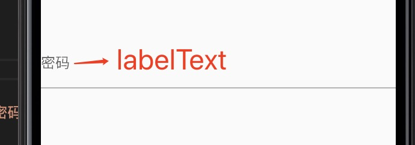
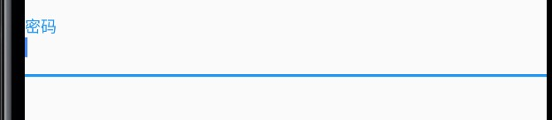
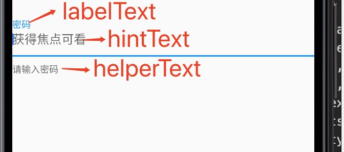

1. InputDecoration 输入框装饰类，类似react 组件属性

        this.icon,
        this.labelText,
        this.labelStyle,
        this.helperText,
        this.helperStyle,
        this.helperMaxLines,
        this.hintText,
        this.hintStyle,
        this.hintMaxLines,
        this.errorText,
        this.errorStyle,
        this.errorMaxLines,
        @Deprecated(
        'Use floatingLabelBehavior instead. '
        'This feature was deprecated after v1.13.2.'
        )
        this.hasFloatingPlaceholder = true,
        this.floatingLabelBehavior = FloatingLabelBehavior.auto,
        this.isCollapsed = false,
        this.isDense,
        this.contentPadding,
        this.prefixIcon,
        this.prefixIconConstraints,
        this.prefix,
        this.prefixText,
        this.prefixStyle,
        this.suffixIcon,
        this.suffix,
        this.suffixText,
        this.suffixStyle,
        this.suffixIconConstraints,
        this.counter,
        this.counterText,
        this.counterStyle,
        this.filled,
        this.fillColor,
        this.focusColor,
        this.hoverColor,
        this.errorBorder,
        this.focusedBorder,
        this.focusedErrorBorder,
        this.disabledBorder,
        this.enabledBorder,
        this.border,
        this.enabled = true,
        this.semanticCounterText,
        this.alignLabelWithHint,

+ icon： 图标

+ labelText： 标签文字

+ helperText: 帮助文字

+ helperStyle: 帮助文字样式

+ hintText: 获取焦点时显示的文字

+ prefix: 前缀组件

+ 