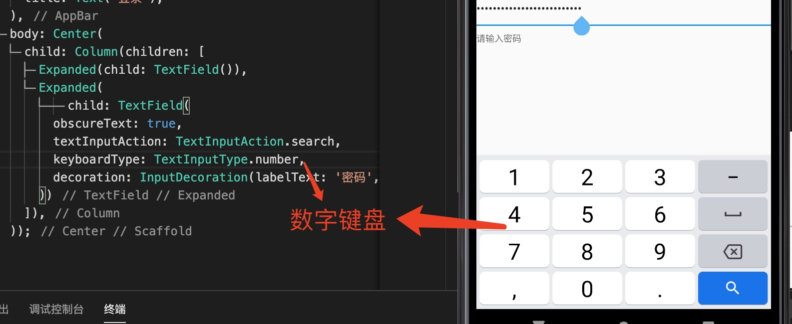
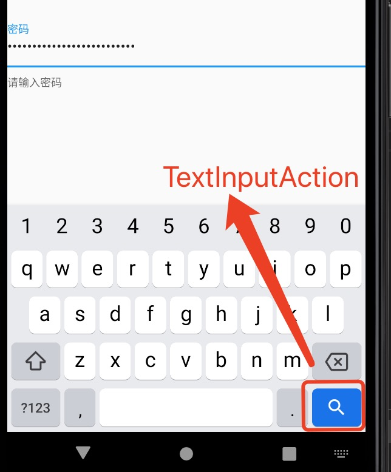
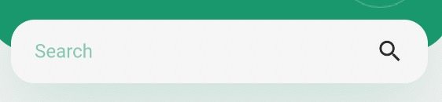

1. Textfield

+ keyboardType： 键盘类型

+ style：样式

+ enabledBorder: InputBorder.none
                        
+ focusedBorder: InputBorder.none,

+ border: 边框

+ textAlign： 水平对齐

+ readOnly: 只读

+ autofocus： 自动获取焦点

+ maxLines： 最大行数

+ onChanged：事件

+ enabled： 是否可用

+ textInputAction: 

   textInputAction : 枚举，

+ obscureText: true,//是否是密码

+ onEditingComplete 和 onSubmitted

+ controller: 通过controller 获取文本框的值

当配置属性 textInputAction 是 就有变化 比如down之类才有效 （none 是无效的）

2. 获取TextField 输入框的值

> 使用controller 

          @override
            Widget build(BuildContext context) {
               final controller = TextEditingController(); // 实例化controller
               controller.addListener(() {
                  print('input ${controller.text}');// 实时监听文本框的输入
               });
               return Form(
                  child: Center(
                     child: Column(
                        children: [
                           TextFormField(
                           decoration: InputDecoration(labelText: '用户名'),
                           controller: controller,
                           ),
                           TextFormField(decoration: InputDecoration(labelText: '密码'), obscureText: true),
                           ElevatedButton(
                           child: Text('登录'),
                           onPressed: () {
                              print(controller.text);// 获取文本框的值
                           },
                        ),
          ])));

> 使用onChanged 回调

         TextField(
            onChanged: (text) {
               print("First text field: $text");
            },
         );

3. 自定义文本框

         Container(
            alignment: Alignment.center,
            margin: EdgeInsets.symmetric(horizontal: 20),
            padding: EdgeInsets.symmetric(horizontal: 20),
            height: 54,
            decoration: BoxDecoration(color: Colors.white, borderRadius: BorderRadius.all(Radius.circular(20))),
            child: Row(
              children: [
                Expanded(
                  child: TextField(
                    decoration: InputDecoration(
                      hintText: 'login',
                      hintStyle: TextStyle(color: kPrimaryColor.withOpacity(0.5)),
                      border: InputBorder.none,
                    ),
                  ),
                ),
                Icon(Icons.search),
              ],
            ),
          ),
