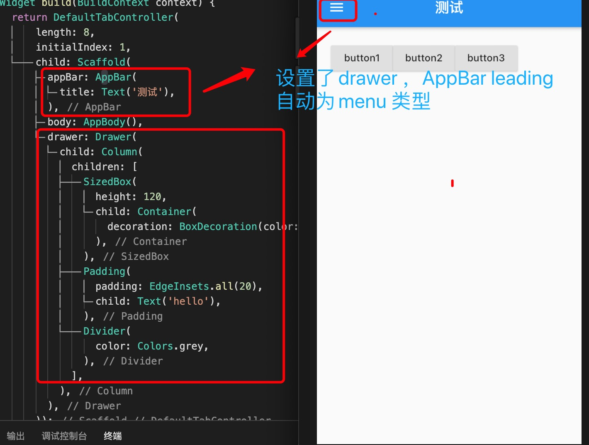
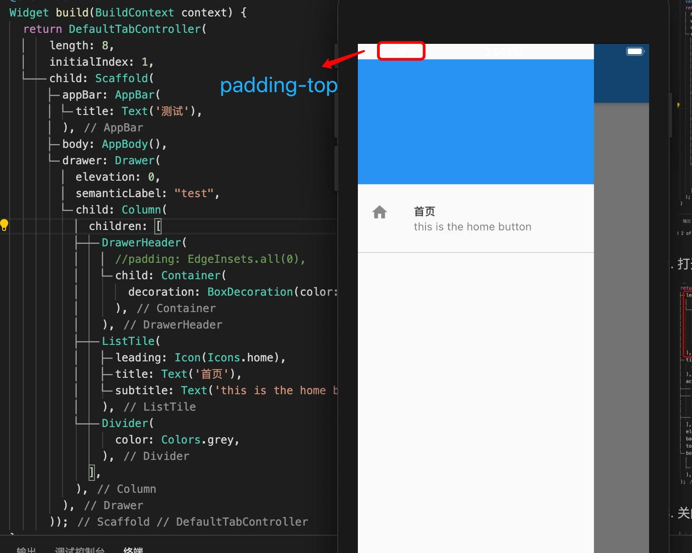
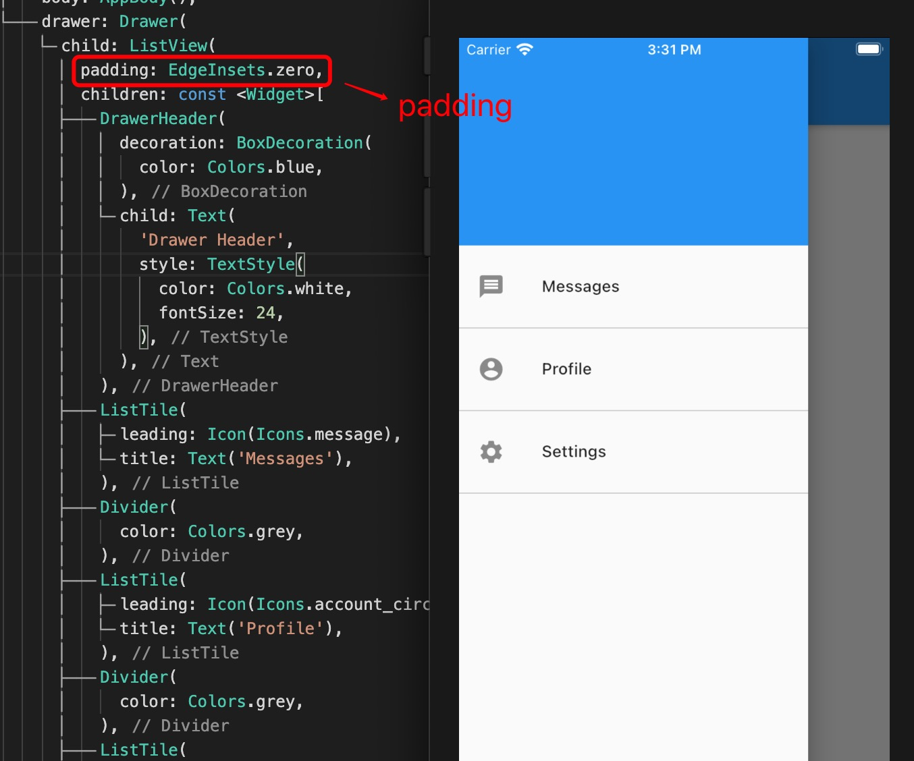
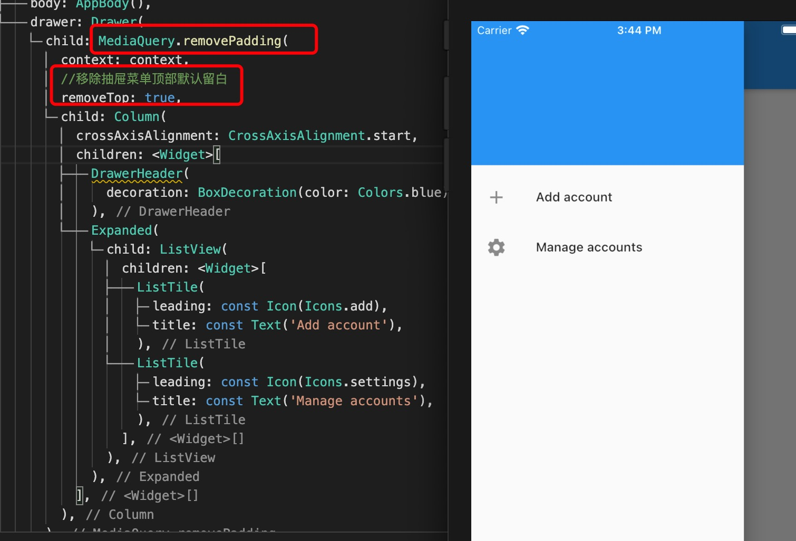
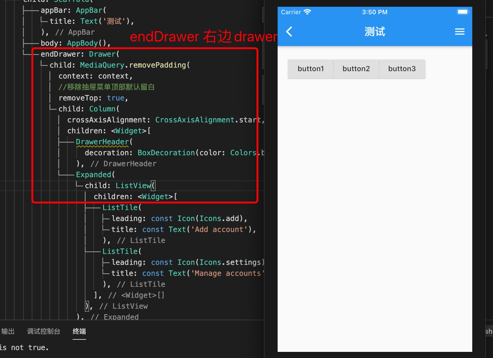

1. Drawer 抽屉（侧滑栏）组件

    当Scaffold 设置了Drawer ,AppBar 的leading 自动设置为menu 

   

2. Drawer 组件参数

> child: 子组件

3. 去除drawer 顶部padding

   

> 使用ListView 作为draw 的子元素，然后使用 ListView 中的padding

   

> 使用RemovePadding

   

4. 左右drawer

> Scaffold 中设置endDrawer 显示在右边

   
   