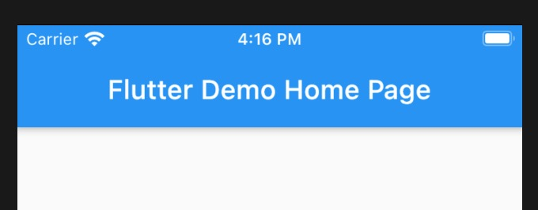

1. material 风格的App 根组件必须是MaterialApp

2. MaterialApp 

   > title: app 的名称，当app 处于状态管理时显示的名称

   

   > home: 主页显示的组件

        class MyApp extends StatelessWidget {
            const MyApp({Key key}) : super(key: key);

            @override
            Widget build(BuildContext context) {
                return MaterialApp(
                    title: '第一sr个电商app',
                    home: Home() // 主要显示的组件
                );
            }
        }

   > debugShowCheckedModeBanner：true/false 去掉右上角debug

   + true :显示debug ，默认为true
   

   + false : 不显示debug,默认为false

   

   > routes:const <String, WidgetBuilder>{} 路由

   

   > initialRoute: 初始化路由，即App打开时显示的页面

   ***initialRoute 和 home 冲突***

        @override
        Widget build(BuildContext context) {
            return MaterialApp(
                // title
                title: '第一sr个电商app',
                // 去掉右上角debug
                debugShowCheckedModeBanner: false,
                // 初始化路由
                initialRoute: '/',
                // 所有页面路由
                routes: {
                    '/': (context) => Home(),
                    '/gridViewDemo': (context) => GridViewDemo(),
                    '/login': (context) => Login(),
                    '/align': (context) => AlignDemo(),
                    'bottom': (context) => ScrollBottom()
                },
            );
        }
    > onUnknownRoute: 路由找不到的情况或者错误404 路由配置

    > theme: 主题