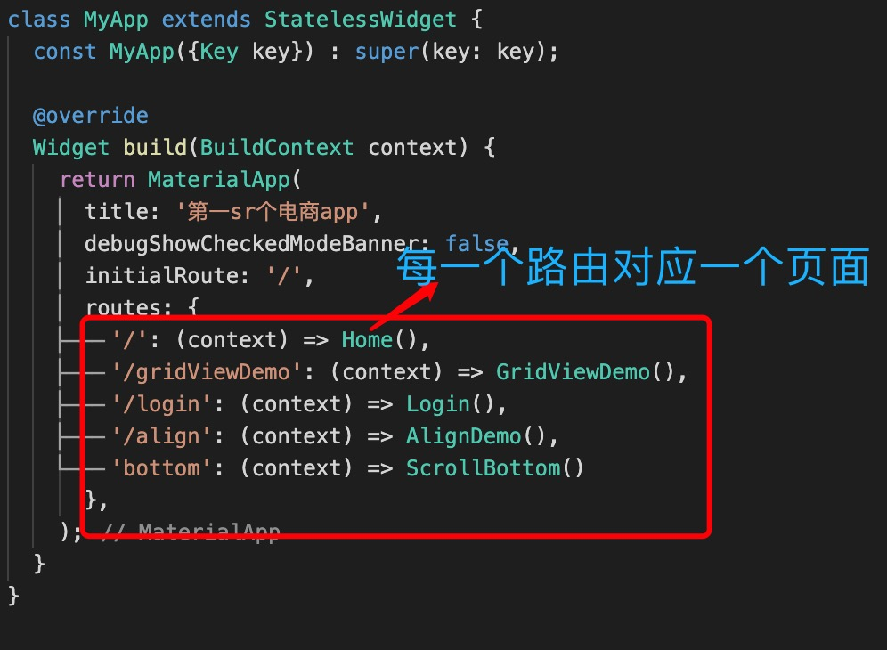
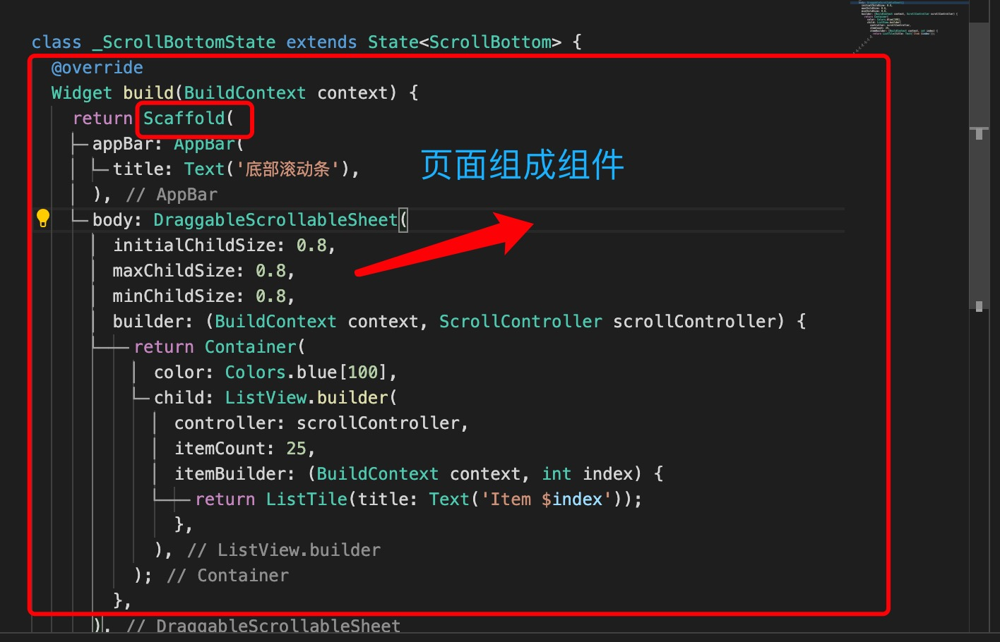
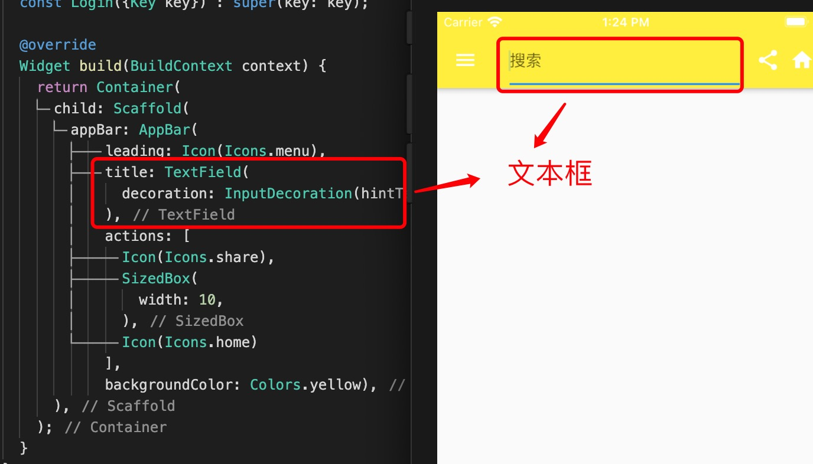
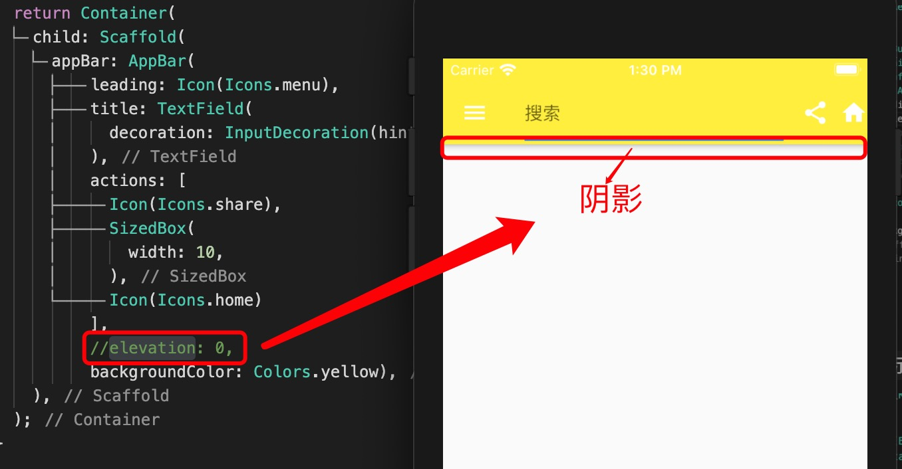
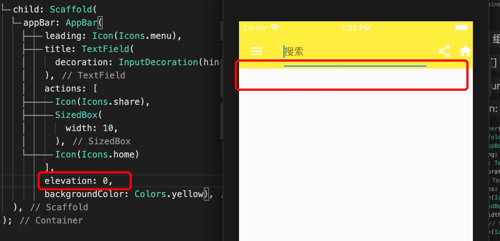
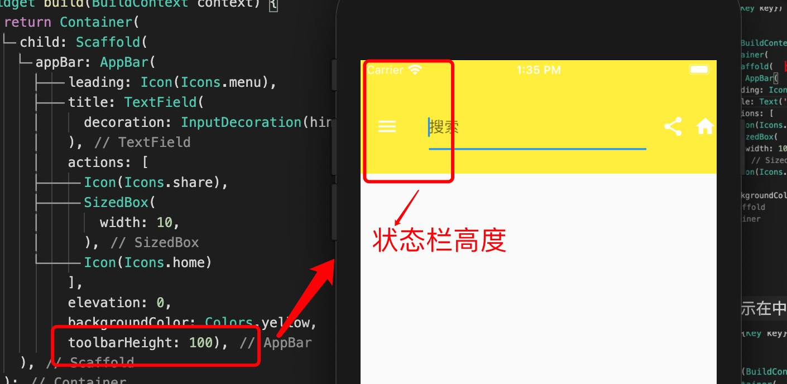
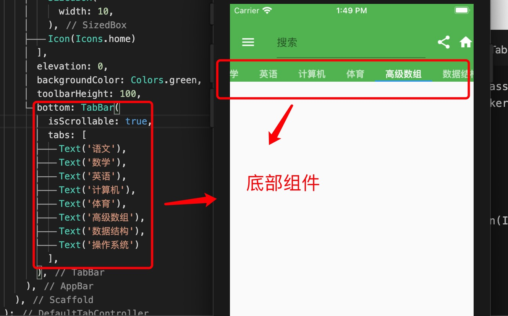
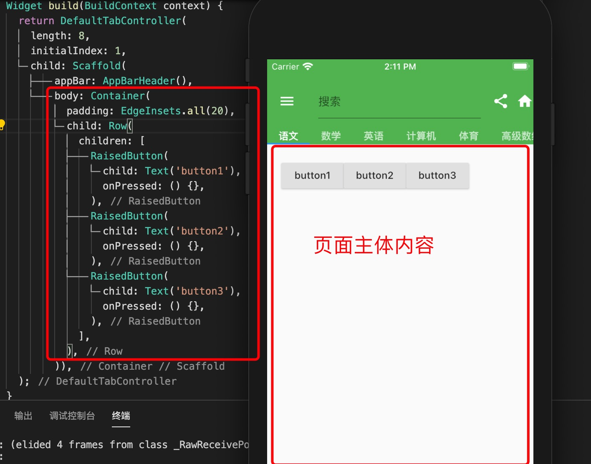
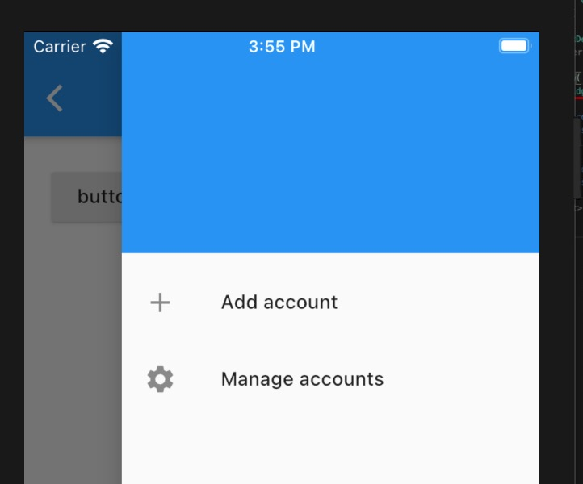

1. 区分页面组件和组件

+ 页面

   

+ 组件： 每个页面由组件组成

   

2. Scaffold:是一个路由页的骨架

   Scaffold 默认占据整屏，提供了顶部状态栏(AppBar),左右抽屉组件（Drawer),顶部导航(bottom Navigator),flatBotton

3. AppBar : 顶部状态栏

   

   > title: 显示在中间位置的组件，不止是文本

   

   > leading: 组件，左侧头部组件

   > actions:[] 右边显示的组件

   > backgroundColor: 状态栏背景颜色

   > elevation: 阴影

   
   

   > toolbarHeight: 状态栏高度

   

   > bottom : 底部组件

   

4. body: 主体内容

   

5. drawer: 抽屉左侧滑组件， endDrawer : 右边侧滑

   

6. 