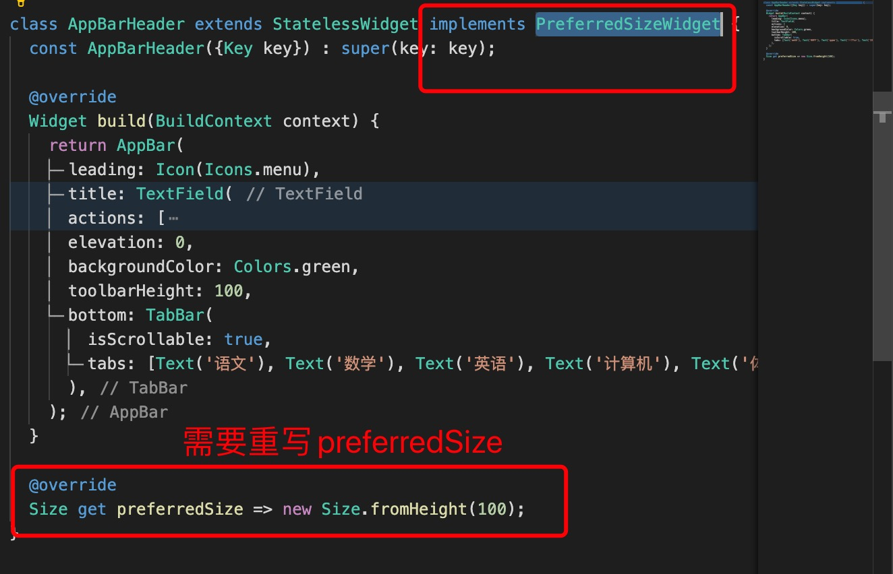

1. AppBar 是PreferredSizeWidget 类型的组件，有时候当AppBar 配置比较复杂或者需要自定义AppBar 时，我们要抽出一个组件，然而组件是StatelessWidget 或者 StatefulWidget 组件，而AppBar 是PreferredSizeWidget 类型，因此我们需要实现PreferredSizeWidget

   

        class AppBarHeader extends StatelessWidget implements PreferredSizeWidget {
            const AppBarHeader({Key key}) : super(key: key);

        @override
        Widget build(BuildContext context) {
            return AppBar(
                // 左边icon
                leading: Icon(Icons.menu),
                // 标题
                title: TextField(
                    decoration: InputDecoration(hintText: '搜索'),
                ),
                actions: [
                    Icon(Icons.share),
                    SizedBox(
                    width: 10,
                    ),
                    Icon(Icons.home)
                ],
                // 阴影
                elevation: 0,
                // 状态栏背景颜色
                backgroundColor: Colors.green,
                // 状态栏高度
                toolbarHeight: 100,
                // 状态栏底部组件
                bottom: TabBar(
                    // 是否有滚动条
                    isScrollable: true,
                    tabs: [Text('语文'), Text('数学'), Text('英语'), Text('计算机'), Text('体育'), Text('高级数组'), Text('数据结构'), Text('操作系统')],
                ),
            );
        }

            @override // 实现PreferredSizeWidget 需要重写preferredSize
            Size get preferredSize => new Size.fromHeight(100);
        }